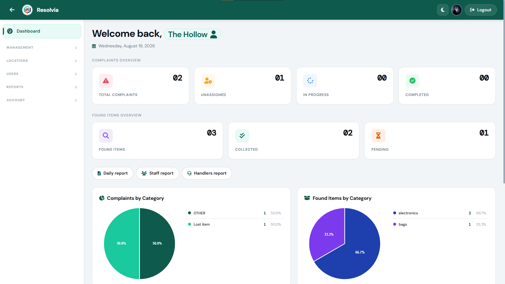
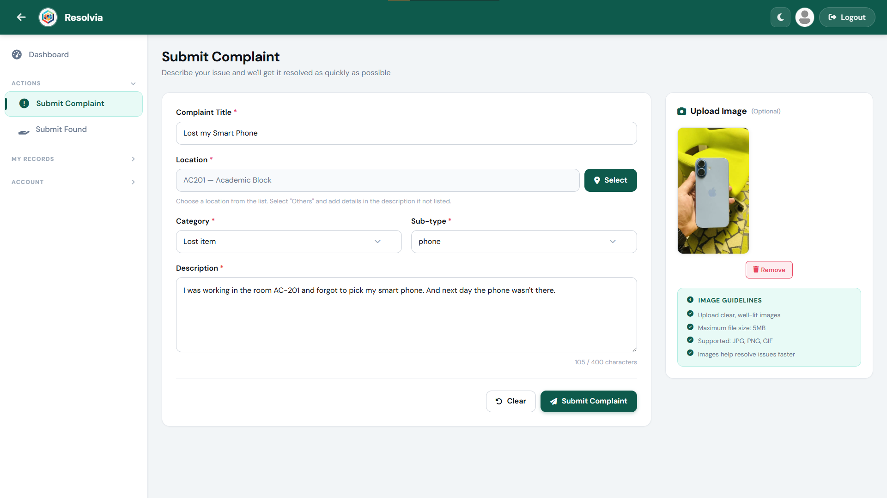
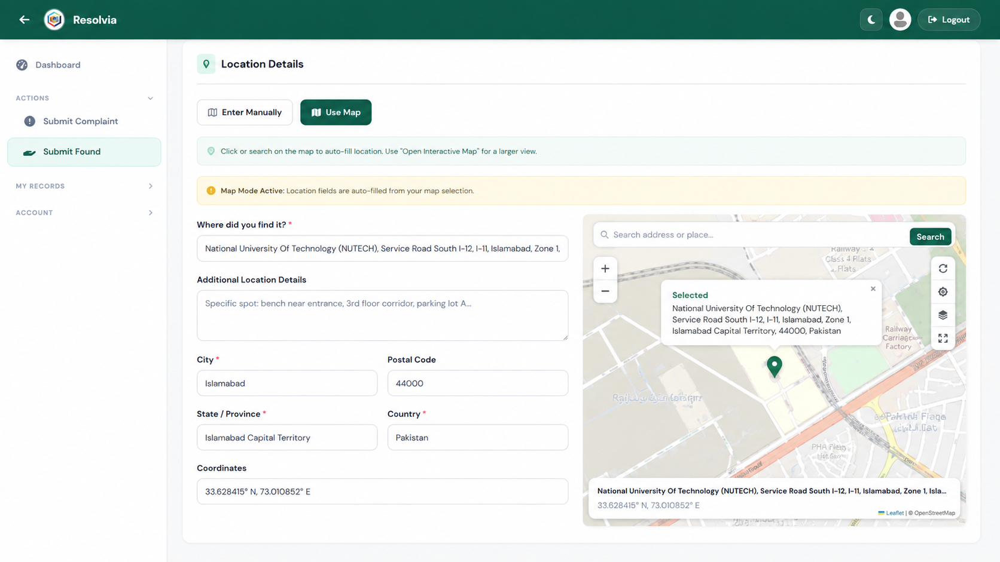

<div align="center">
  
  
  # Resolvia

  **Comprehensive Facility Management & Resolution System**
</div>

---

## 📖 Overview
Resolvia is a modern, full-stack application built to seamlessly manage facility complaints and lost & found items. With an intuitive interface and role-based access, Resolvia empowers customers, handlers, and staff to collaborate effectively, ensuring that every issue is tracked, assigned, and resolved in a timely manner.

## 🚀 Key Modules & Design

### Secure Authentication & Access
Security and user experience are at the forefront of Resolvia. The login portal offers a clean, streamlined entry point for all users, dynamically routing them to their respective dashboards based on their role (e.g., Customer, Staff, Complaint Receiver, Admin). The minimalistic approach removes friction while maintaining high security.

<div align="center">
  
  <br>
  <em>The unified login portal ensuring secure and role-based entry.</em>
</div>

---

### Interactive Dashboards
The dashboard provides a bird's-eye view of all ongoing operations. With dynamic charts, statistical summaries, and quick-action widgets, managers and handlers can prioritize their workflow. It's designed to be clean and informative, reducing cognitive load and highlighting urgent tasks immediately.

<div align="center">
  
  <br>
  <em>Analytics and task management dashboard for real-time monitoring.</em>
</div>

---

### Complaints Management
Filing a complaint shouldn't be a hassle. The complaint submission module offers a structured, user-friendly form that guides the user through selecting the nature of the issue, location (featuring interactive maps with reverse geocoding), and supporting evidence (like images). This ensures the maintenance team receives accurate, actionable information to resolve the issue promptly.

<div align="center">
  
  <br>
  <em>Streamlined complaint logging with reverse geocoded location selection.</em>
</div>

---

### Lost and Found System
Resolvia integrates a robust Lost and Found module that allows users to report found items with precise location data and images. The location selection is enhanced by reverse geocoding, which automatically converts map coordinates into human-readable addresses. It features a transparent claiming process, making it easy to reunite lost items with their rightful owners while keeping a clear audit trail.

<div align="center">
  
  <br>
  <em>Detailed reporting interface for found items, ensuring precise tracking.</em>
</div>

---

## 🛠️ Setup & Installation

Follow these steps to get Resolvia running on your local machine:

1. **Clone the repository:**
   ```bash
   git clone https://github.com/ali38958/Resolvia.git
   cd Resolvia
   ```

2. **Install Dependencies:**
   ```bash
   npm install
   ```

3. **Database Setup (MySQL):**
   - Ensure you have MySQL installed and running.
   - Import the provided SQL dump file located in the root directory (`complaints_management_db.sql`) into your MySQL server.

4. **Environment Variables:**
   - Open the `.env` file in the root directory.
   - Populate the necessary database credentials (`DB_USER`, `DB_PASSWORD`), secret keys, and email configuration.

5. **Start the Application:**
   ```bash
   npm start
   ```

---

## 🔗 Repository
[https://github.com/ali38958/Resolvia](https://github.com/ali38958/Resolvia)

---

## 👨‍💻 Author
**Muhammad Ali**
- GitHub: [@ali38958](https://github.com/ali38958)
